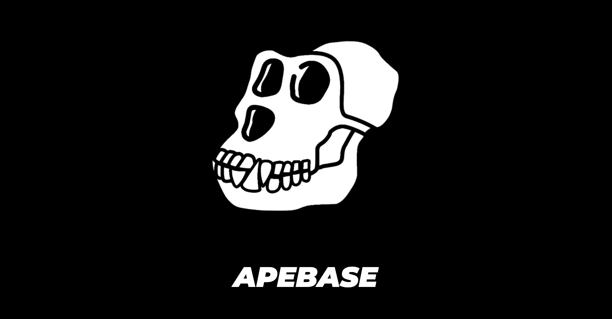
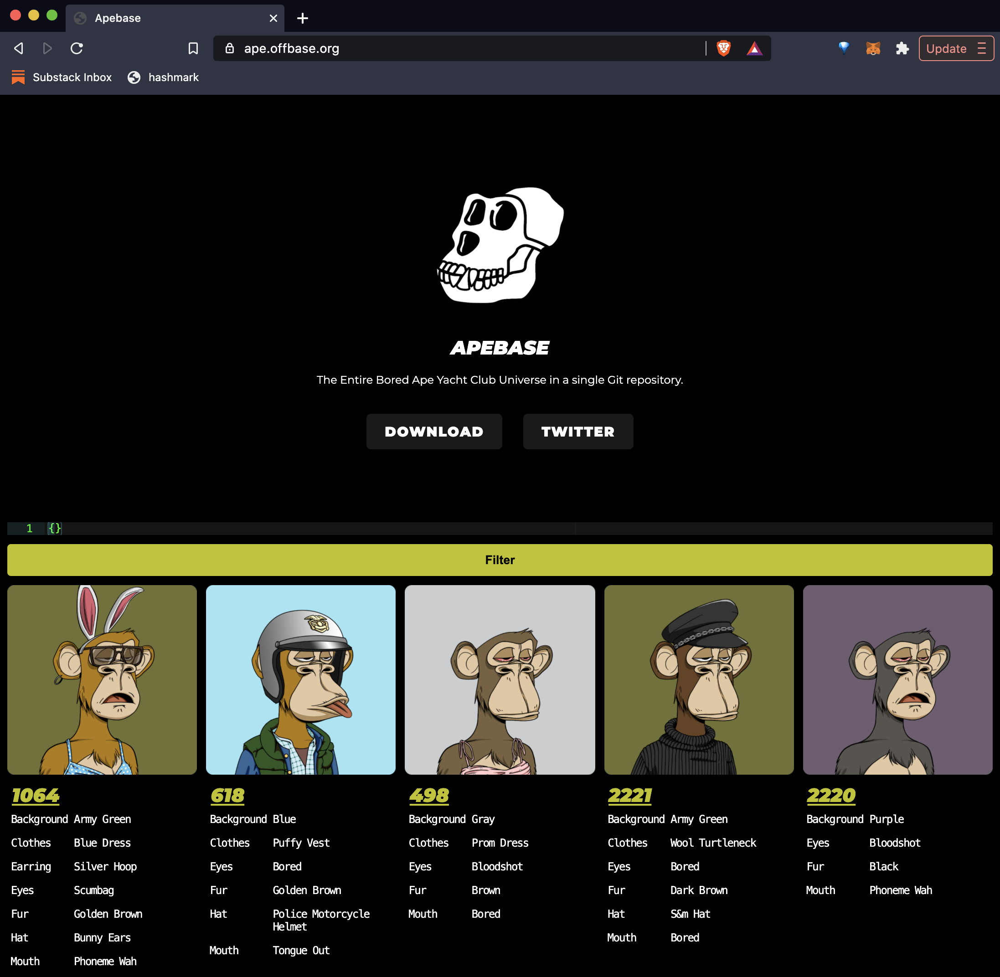

# Apebase

> Bored Ape Database



Apebase is the entire 10,000 Bored Ape Yacht Club NFT Universe stored in a single Git repository. It's made up of:

1. **DB:** The entire metadata database stored in a [6MB file](db)
2. **IPFS:** All IPFS files stored under [ipfs folder](ipfs) without having to run your own IPFS node!

[Try Demo](https://ape.offbase.org)

[Stay updated on Twitter](https://twitter.com/skogard)

[Ask questions on GitHub](https://github.com/skogard/apebase/issues)


---

# Why?

When you work with NFTs you often need to query some 3rd party API.

But if you think about it, you really don't need to rely on them for working with NFT assets (images, videos, files, etc.) and metadata (name, description, attributes, etc.). After all, they're all immutable!

With Apebase, you can simply download the entire NFT universe through a single `git clone` and work with it **100% locally and offline**. Use it in your app as often as you want, for free, forever!.

- No IPFS connection required
- No Blockchain connection required
- No 3rd party API required

---

# How it works

1. **DB:** The entire database is stored as a single immutable file at [db](db). This file was constructed by crawling the Ethereum blockchain once (You only need to do it once, since NFT metadata are immutable!)
2. **IPFS:** All IPFS files are stored under the IPFS CID name WITHOUT having to run an IPFS node. It's all in this Git repository under [ipfs](ipfs) folder.

## 1. DB

Apebase stores all of the following metadata in a file and makes them queryable:

- **tokenId:** Unique identifier for the NFT
- **tokenURI:** The metadata token URI
- **metadata**
  - **image:** IPFS image url
  - **attributes:** eyes, fur, clothes, hat, mouth, etc.

Here's what an example item looks like on Apebase:

```
{
  "metadata": {
    "image": "ipfs://QmYsWYyQL2rTykTb8a9erJ6cSRRLqpC1sk3NE7n6SbgAaJ",
    "attributes": [
      {
        "trait_type": "Mouth",
        "value": "Bored"
      },
      {
        "trait_type": "Background",
        "value": "Aquamarine"
      },
      {
        "trait_type": "Hat",
        "value": "Girl's Hair Short"
      },
      {
        "trait_type": "Eyes",
        "value": "Scumbag"
      },
      {
        "trait_type": "Clothes",
        "value": "Biker Vest"
      },
      {
        "trait_type": "Fur",
        "value": "Black"
      }
    ]
  },
  "id": "3478",
  "uri": "ipfs://QmeSjSinHpPnmXmspMjwiXyN6zS4E9zccariGR3jxcaWtq/3478",
  "transactionHash": "0xaca36dfb1f6806c39f6b45f2c6e37c6ab7331691e6c42725f2f0a0ba23d7c4d9",
  "blockHash": "0x5142d5a61ebf5c5942c08ca17f0b42b62879be66bf7d951b97548efef648ef4d",
  "blockNumber": 12346921,
  "_id": "002DtMlJBly663jG"
}
```

Best of all, all this is 100% **verifiable** and **immutable**, so you can feel free to use this without worrying about authenticity!

## 2. IPFS

Apebase also lets you access all IPFS files WITHOUT running an IPFS node!

Simply clone this git repository and it contains all 10,000 IPFS files for the Bored Ape Universe! (See [ipfs](ipfs))

---

# Quickstart

This repository contains the entire Apebase query engine web app at [https://ape.offbase.org](https://ape.offbase.org). Let's try it out.

First, clone the repository for the ape query app (at https://github.com/skogard/apequery):

```
git clone https://github.com/skogard/apequery.git
```

Next, install and start the server:

```
npm install
npm start
```

Finally, open the explorer at: http://localhost:3010

You will see the following screen:



You can also try the online demo here: https://ape.offbase.org

---

# Usage


## 1. Download

Simply clone this repository to get started!

```
git clone https://github.com/skogard/apedb.git
```

## 2. Use

The DB is stored as [NeDB](https://github.com/louischatriot/nedb), a file based database that implements MongoDB queries.

Once you've downloaded the repository, you will find the following:

1. DB: At [db](db)
2. IPFS FILES: Under [ipfs](ipfs)

To query the DB, use the [NeDB](https://github.com/louischatriot/nedb) library. First install the `nedb` module:

```
npm install nedb
```

And then just use it!

```
const Datastore = require('nedb')
const db = new Datastore({ filename: './db', autoload: true });
const query = {
  "metadata.attributes": {
    "$elemMatch": {
      "trait_type": "Clothes",
      "value": "Striped Tee"
    }
  }
}
db.find(query, (err, docs) => {
  console.log("docs = ", docs)
})
```

---

# FAQ

Interested in seeing this for other NFTs?

I'm thinking of open sourcing the engine that created the ApeDB if enough people are interested. Let me know!

You can find me at [@skogard](https://twitter.com/skogard)
